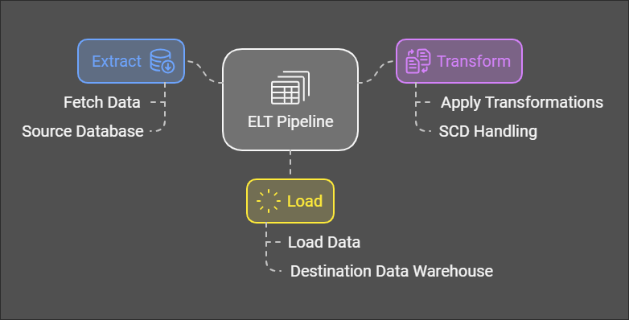

# Olist Data Warehouse: Slowly Changing Dimensions (SCD) and ELT Pipeline

# Table of Contents
1. [Overview](#overview)
2. [Requirements Gathering](#requirements-gathering)
3. [Slowly Changing Dimension (SCD)](#slowly-changing-dimension-scd)
   1. [Strategy](#strategy)
4. [ELT with Python & SQL](#elt-with-python--sql)
   1. [Workflow Description](#workflow-description)
   2. [Setup and Execution](#setup-and-execution)
   3. [Code Highlights](#code-highlights)
5. [Orchestrate ELT with Luigi](#orchestrate-elt-with-luigi)
   1. [Setup Instructions](#setup-instructions)
6. [Requirements](#requirements)
7. [References](#references)

---

## Overview
This project implements a Data Warehouse (DWH) for Olist, leveraging Slowly Changing Dimensions (SCD) strategies and an ELT pipeline using Python, SQL, and Luigi for orchestration.

## Requirements Gathering
Below are some of the most critical questions and answers gathered during the requirements phase for SCD strategy scope:

1. **Which tables should track historical changes using SCD Type 2?**  
   Historical tracking is critical for tables like **customers**, **orders**, and **sellers**, as customer locations, order statuses, and seller information can evolve over time.

2. **What key columns should be monitored for changes in these tables?**  
   Columns like `customer_state`, `customer_city`, `order_status`, and `seller_city` are essential to track, as they provide insights into business dynamics and trends.

3. **How should review data in the order_reviews table be handled?**  
   Review data is considered static once recorded. Any updates typically represent corrections rather than historical events, so versioning isn’t necessary.

4. **Is it necessary to track timestamps at a more granular level than dates?**  
   No, tracking changes at the date level is sufficient since most business processes align with daily activities.

5. **Should changes in product attributes like weight or dimensions be tracked?**  
   No, these attributes rarely change. When they do, it’s enough to update them directly using SCD Type 1.

6. **Do we need to simplify or aggregate certain data for easier reporting?**  
   Yes, aggregating data in lightweight tables like **geolocation** and **product_category_name_translation** will make analytics more efficient.

7. **What SCD type should be used for customers and sellers?**  
   SCD Type 2 is ideal for customers and sellers to track changes in details like address or state over time.

8. **Should order statuses be subject to historical tracking?**  
   Yes, tracking the full lifecycle of an order statuses like "approved," "shipped," and "delivered" is essential for analyzing the delivery process and identifying potential delays. We want to see the full journey of an order, like when it was approved, shipped, and delivered. This helps us understand the delivery process and where delays might occur.

## Slowly Changing Dimension (SCD)
### Strategy
Based on the gathered requirements, the following SCD strategies will be applied:

| Dimension Table      | SCD Type | Explanation                                                                 |
|----------------------|----------|-----------------------------------------------------------------------------|
| dim_customers        | Type 2   | Customer details change over time. Use `created_at`, `expired_at`, and `current_flag`. |
| dim_products         | Type 1   | Product attributes require corrections rather than versioning. Use `created_at` and `updated_at`. |
| dim_sellers          | Type 2   | Seller details, such as location, may change. Use `created_at`, `expired_at`, and `current_flag`. |
| dim_order_payments   | Type 1   | Payment information doesn’t need historical tracking; corrections can be applied directly. Use `created_at` and `updated_at`. |
| dim_order_reviews    | Type 1   | Reviews are fixed once submitted. Use `created_at` and `updated_at`.       |
| dim_orders           | Type 2   | Order statuses (e.g., approved, delivered) change over time. Use `created_at`, `expired_at`, and `current_flag`. |
| dim_order_items      | Type 1   | Order items remain static once recorded. Use `created_at` and `updated_at`. |

## ELT with Python & SQL

### Workflow Description
The ELT pipeline consists of three main steps:
1. **Extract:** Fetch data from the source PostgreSQL database.
2. **Transform:** Apply transformations, including SCD handling.
3. **Load:** Load transformed data into the DWH PostgreSQL database.



### Setup and Execution
1. Clone the repository (using git lfs clone).
2. Create a `.env` file with the following variables:

```env
# Source
SRC_POSTGRES_DB=olist-src
SRC_POSTGRES_HOST=localhost
SRC_POSTGRES_USER=[YOUR USERNAME]
SRC_POSTGRES_PASSWORD=[YOUR PASSWORD]
SRC_POSTGRES_PORT=[YOUR PORT]

# SENTRY DSN
SENTRY_DSN=... # Fill with your Sentry DSN Project 

# DWH
# Adjust with your directory. make sure to write full path
# Remove comment after each value
DIR_ROOT_PROJECT=... # <project_dir>
DIR_TEMP_LOG=... # <project_dir>/pipeline/temp/log
DIR_TEMP_DATA=... # <project_dir>/pipeline/temp/data
DIR_EXTRACT_QUERY=... # <project_dir>/pipeline/src_query/extract
DIR_LOAD_QUERY=... # <project_dir>/pipeline/src_query/load
DIR_TRANSFORM_QUERY=... # <project_dir>/pipeline/src_query/transform
DIR_LOG=... # <project_dir>/logs/
```

3. Ensure the `/helper/source/init.sql` script has the data preloaded.
4. Run `elt_main.py` to execute the pipeline.
5. Monitor logs in the `/logs/logs.log/` directory for any errors.

**Run this command on the background process:**
```bash
luigid --port 8082
```

**To run the pipeline directly from the terminal:**
```bash
python3 elt_main.py
```

**Alternatively, schedule the pipeline using cron to run every hour:**
```bash
0 * * * * <project_dir>/elt_run.sh
```

### Code Highlights
- **Scripts:** Clean and modularized for easy maintenance.
- **Error Handling:** Alerts for pipeline errors.
- **Logging:** Comprehensive logs for each pipeline step.

## Requirements
Install dependencies with:
```bash
pip install -r requirements.txt
```

## References
1. **Luigi Documentation**: [https://luigi.readthedocs.io/](https://luigi.readthedocs.io/)
2. **Slowly Changing Dimensions (SCD) Overview**: Kimball, Ralph. *The Data Warehouse Toolkit: The Definitive Guide to Dimensional Modeling*. Wiley, 2013.
3. **PostgreSQL Documentation**: [https://www.postgresql.org/docs/](https://www.postgresql.org/docs/)
4. **Sentry SDK for Python**: [https://docs.sentry.io/platforms/python/](https://docs.sentry.io/platforms/python/)